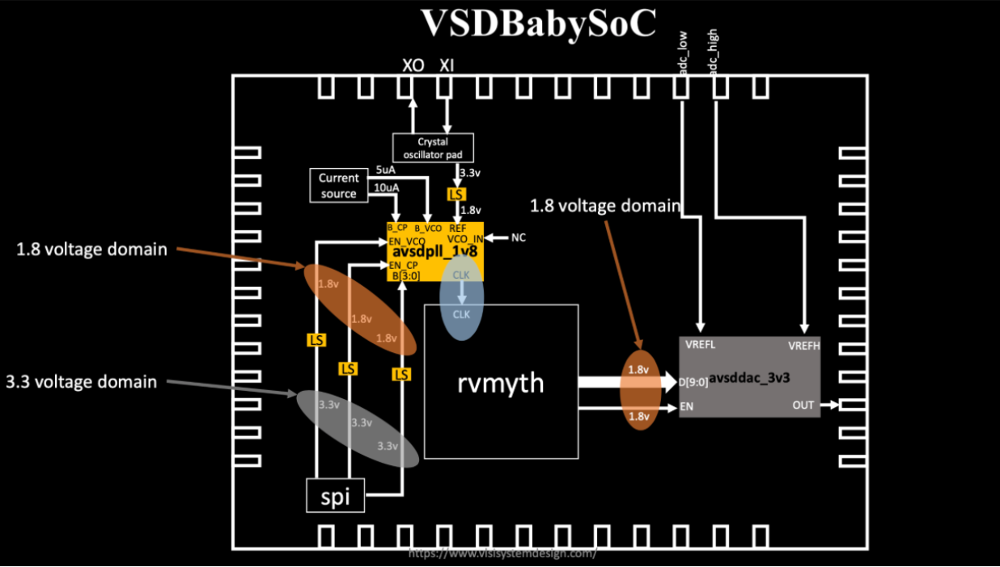
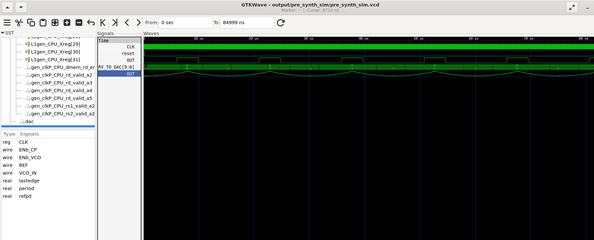

# Fundamentals of System-on-Chip (SoC) Design

## What is a System-on-Chip (SoC)?

A **System-on-Chip (SoC)** is an integrated circuit that combines most components of a computer system—including CPU, memory, I/O, GPU, DSP, and analog blocks—onto a single chip.  

This level of integration offers:
- **Compact design** → Ideal for mobile and embedded devices  
- **Energy efficiency** → Reduced power consumption and extended battery life  
- **Performance** → On-chip communication reduces latency  
- **Cost savings** → Fewer external components and simplified packaging  

---

## Core Components of an SoC

| Component | Function |
|-----------|----------|
| CPU       | General-purpose computation and control |
| Memory    | Stores instructions, data, and cache |
| I/O       | Interfaces to peripherals (USB, camera, sensors, buses) |
| GPU / DSP | Handles graphics, signal processing, or AI tasks |
| Power Management | Voltage regulation, clocking, and thermal control |
| Analog / Mixed-Signal | DACs, ADCs, PLLs, RF blocks |
| Connectivity | Wi-Fi, Bluetooth, 5G, Ethernet |

---

## SoC Design Flow

1. **Specification** – Define requirements and constraints  
2. **High-Level Modeling** – Functional modeling (SystemC, C/C++)  
3. **RTL Design** – Implementation in Verilog/VHDL/TL-Verilog  
4. **Verification** – Simulation, formal checks, testbenches  
5. **Physical Design** – Synthesis, floorplanning, place & route  
6. **Fabrication & Testing** – Silicon tape-out and validation  

---

## Types of SoCs

- **Microcontroller-based SoCs** → small, low-power control systems  
- **Microprocessor-based SoCs** → richer feature sets, run OS (smartphones, tablets)  
- **Application-Specific SoCs** → AI accelerators, networking chips, automotive controllers  

---

# VSDBabySoC – Educational RISC-V SoC

VSDBabySoC is a miniature educational SoC designed on **Sky130 open-source PDK**.  
It integrates three main components:

- **RVMYTH Core** – Lightweight RISC-V CPU  
- **PLL (avsdpll)** – Generates internal clock  
- **10-bit DAC (avsddac)** – Converts CPU register values into analog output

  

**Objective**: Demonstrate integration of digital + analog IPs and test SoC-level functionality.

---

## Project Structure

```

VSDBabySoC/
├── src/
│   ├── include/      # Header / macros (*.vh)
│   ├── module/       # Verilog + TLV modules
│   │   ├── vsdbabysoc.v   # Top-level RTL
│   │   ├── rvmyth.tlv     # CPU in TL-Verilog
│   │   ├── rvmyth.v       # Converted Verilog CPU
│   │   ├── avsdpll.v      # PLL
│   │   ├── avsddac.v      # DAC
│   │   └── testbench.v    # Testbench
└── output/                # Simulation results

````

---

## Setup

### 1. Clone Repository

```bash
cd ~/VLSI
git clone https://github.com/manili/VSDBabySoC.git
cd VSDBabySoC/
````

---

### 2. Install Dependencies

```bash
sudo apt update
sudo apt install -y python3-venv python3-pip iverilog gtkwave
```

---

### 3. Create Python Environment and Install SandPiper-SaaS

```bash
python3 -m venv sp_env
source sp_env/bin/activate
pip install pyyaml click sandpiper-saas
```

---

### 4. Convert TL-Verilog → Verilog

```bash
cd src/module
sandpiper-saas -i rvmyth.tlv -o rvmyth.v --bestsv --noline -p verilog --outdir .
cd ../../
```

---

### 5. Pre-Synthesis Simulation

```bash
mkdir -p output/pre_synth_sim

iverilog -o output/pre_synth_sim/pre_synth_sim.out \
  -DPRE_SYNTH_SIM \
  -I src/include -I src/module \
  src/module/testbench.v

cd output/pre_synth_sim
./pre_synth_sim.out
```

View in GTKWave:

```bash
gtkwave pre_synth_sim.vcd
```

---

## Signals to Observe

* `clk` → Clock (from PLL)
* `reset` → Reset signal
* `rv_to_dac[9:0]` → RISC-V output driving DAC
* `out` → DAC output (digital in sim, represents analog)

  

---

## Example CPU Instruction Program

The CPU increments registers, accumulates values, generates oscillations, and then holds steady. Register `r17` drives the DAC.

| Instruction         | Action          |
| ------------------- | --------------- |
| `ADDI r9, r0, 1`    | step = 1        |
| `ADDI r10, r0, 43`  | loop limit = 43 |
| `ADDI r11, r0, 0`   | counter = 0     |
| `ADD r17, r17, r11` | accumulate      |
| ...                 | ...             |

---

## DAC Output Calculation

For a 10-bit DAC with Vref = 1.0 V:

```
Vout = (r17 / 1023) × Vref
```

* r17 = 903 → Vout ≈ 0.882 V
* r17 = 946 → Vout ≈ 0.925 V

---

## Troubleshooting

* **Redefinition errors**: Ensure files aren’t included twice
* **Wrong paths**: Use absolute paths for iverilog/gtkwave if needed
* **Waveform issues**: In GTKWave, switch DAC output to “analog step” view

---

## Future Work

* Replace hardcoded instructions with firmware loader
* Support C toolchain → compile programs → load into memory
* Add peripherals and external memory for richer SoC environment
* Explore power-aware synthesis and verification

---


